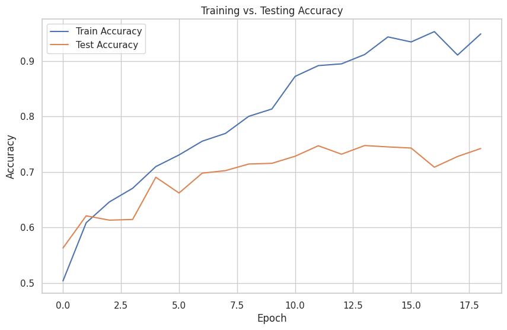
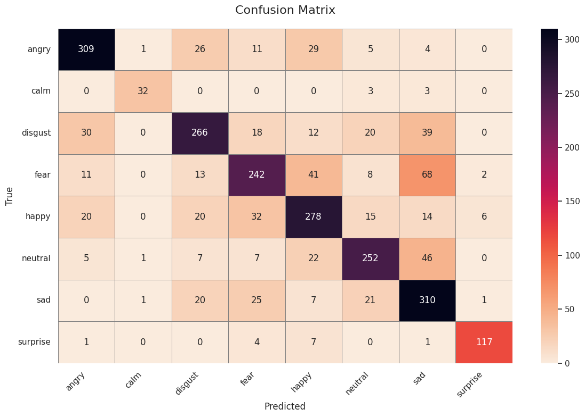
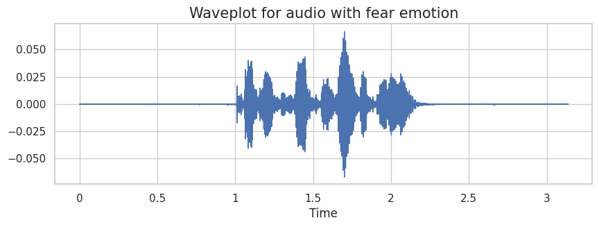
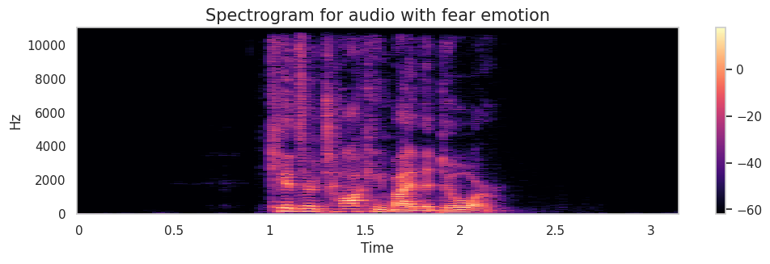

# Speech Emotion Recognition using CRNN

> "Understanding human emotion from voice with deep learning"

This project implements a robust deep learning model to classify human emotions from raw speech audio using MFCC features. We use a Convolutional Recurrent Neural Network (CRNN) combining 1D Convolutions and a Bi-directional GRU for sequential modeling.

---

## 📁 Dataset

**[Speech Emotion Recognition (EN)](https://www.kaggle.com/datasets/dmitrybabko/speech-emotion-recognition-en)**  
Combined from 4 public datasets:
- RAVDESS
- CREMA-D
- TESS
- SAVEE

Emotions considered:
- `angry`, `happy`, `fear`, `disgust`, `neutral`, `sad`, `surprise`, `calm`

**Note:** This dataset is hosted on Kaggle. To download it using the notebook (`opendatasets`), you'll need to set up your Kaggle API key.  
You can do this by following these steps:
1. Go to [Kaggle Account Settings](https://www.kaggle.com/account)
2. Scroll down to the API section and click **"Create New API Token"**
3. A `kaggle.json` file will be downloaded
4. Place this file in your project root or `~/.kaggle/`

For more help, refer to [Kaggle's official API guide](https://github.com/Kaggle/kaggle-api).

---

## 🧠 Model Architecture

```
Input (MFCCs: 40 x 174)
 └── Conv1D (128 filters, ReLU, MaxPool)
    └── Conv1D (256 filters, ReLU, MaxPool)
        └── Conv1D (512 filters, ReLU, MaxPool)
            └── BiGRU (128 units x 2 directions)
                └── Global Avg Pooling
                    └── Dropout + FC (num_classes)
```

Optimized using:
- **CrossEntropyLoss**
- **Adam optimizer** with LR scheduler
- **Early stopping** to prevent overfitting

---

## 🏁 Results

| Metric         | Value        |
|----------------|--------------|
| Train Accuracy | 91.16%        |
| Test Accuracy  | **74.76%**    |
| Loss (final)   | 0.2704       |

---

## 📊 Visuals

### Training vs Testing Accuracy


### Confusion Matrix


### Waveplot & Spectrogram (Example with "fear" emotion)



---

## 💾 Pretrained Model

The trained model is included in the repo as `ser_model.pth` within the `load_model` directory.  
You can load it like this:

```python
import torch
from crnn import EmotionCRNN

model = EmotionCRNN()
model.load_state_dict(torch.load("ser_model.pth", map_location="cpu"))
model.eval()
```

---

## 🛠 How to Run

### 🧪 Using Colab
Just open the notebook and run all cells. GPU recommended.

### 💻 Local Setup
```bash
git clone https://github.com/yourusername/speech-emotion-recognition.git
cd speech-emotion-recognition/notebook
pip install -r requirements.txt
jupyter notebook Speech_Emotion_Recognition.ipynb
```

---

## 🧰 Requirements
See `requirements.txt`, includes:
- PyTorch
- Torchaudio
- Librosa
- Pandas, Matplotlib, Seaborn, Scikit-learn
- OpenDatasets (for auto-downloading)

---

## 📌 File Structure

```
speech-emotion-recognition/
├── load_model/
│   ├── crnn.py
│   └── ser_model.pth
├── notebook/
│   └── Speech_Emotion_Recognition.ipynb
├── statistics/
│   ├── accuracy_plot.png
│   └── confusion_matrix.png
├── visuals/
│   ├── fear_spectrogram.png
│   └── fear_waveplot.png
├── requirements.txt
```

